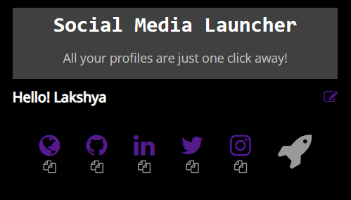
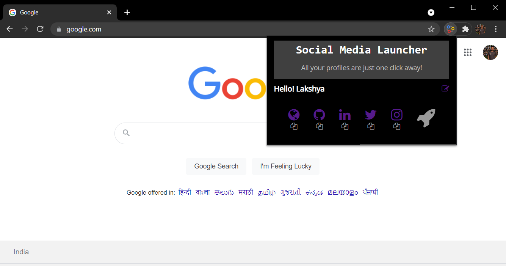

<br />
<p align="center">
  <a href="https://github.com/lakshya-20/socialMedia-chrome-extension">
    
  </a>

  <h1 align="center">Social Media Launcher</h1>

  <p align="center">
    Social Media Launcher is an extension that makes it easy to navigate through your social media profiles like Linkedin, Instagram, Twitter, etc with just one click.
    <br />
    <br />
    <a href="https://github.com/lakshya-20/socialMedia-chrome-extension/issues">Report Bug</a>
    ·
    <a href="https://github.com/lakshya-20/socialMedia-chrome-extension/issues">Request Feature</a>
  </p>
</p>
<details open="open">
  <summary>Table of Contents</summary>
  <ol>
    <li>
      <a href="#about-the-project">About The Project</a>
    </li>
    <li><a href="#usage">Usage</a></li>
    <li><a href="#contributing">Contributing</a></li>
    <li><a href="#contact">Contact</a></li>
  </ol>
</details>

<!-- ABOUT THE PROJECT -->
## About The Project
<h3>
  Social Media Launcher is a chrome extension designed to boost productivity, it limits the amount of time you spend navigating to your social profiles or just copying the profile URL. It lets you save your social media profiles, edit them and rocket launch all social media profiles with one click.
</h3>

### :camera: Screenshots
<p align="center">
  
  <br/>
  <b>Main Component</b>
  <br/>
  <br/>
  
  <br/>
  <b>Edit Component</b>
  <br/>
  <br/>
  
  <br/>
  <b>Social Media Launcher</b>
</p>

### :star: Features
1. Easy to profile navigation with just one click no need of opening a new tab and typing the URL.
2. Copy the profile URL by clicking the clipboard icon and use it to paste anywhere.
3. Launch all social profiles with just one click, saves time from navigating to different profiles when you are starting your day.
4. Update the profile URLs anytime by just clicking the edit button.

### :satellite: Technology Stack
* Chrome storage API
* JavaScript
* HTML
* CSS

## Usage
* Clone the repo
   ```sh
   git clone https://github.com/lakshya-20/socialMedia-chrome-extension.git
   ```
* For adding the extension to chrome follow this [guide](https://support.google.com/chrome/a/answer/2714278?hl=en#:~:text=Go%20to%20chrome%3A%2F%2Fextensions,the%20app%20or%20extension%20folder.)

## Contributing
Any contributions you make are **greatly appreciated**.

1. Fork the Project
2. Create your Feature Branch (`git checkout -b some-new-feature`)
3. Commit your Changes (`git commit -m 'Add some feature'`)
4. In case of multiple commits squash them. [Refer documentation](https://www.internalpointers.com/post/squash-commits-into-one-git)
5. Push to the Branch (`git push origin some-new-feature`)
6. Open a Pull Request

## Contact

Lakshya Bansal - [lakshyabansal](https://www.linkedin.com/in/lakshyabansal/)

Project Link: [https://github.com/lakshya-20/socialMedia-chrome-extension.git](https://github.com/lakshya-20/socialMedia-chrome-extension.git)